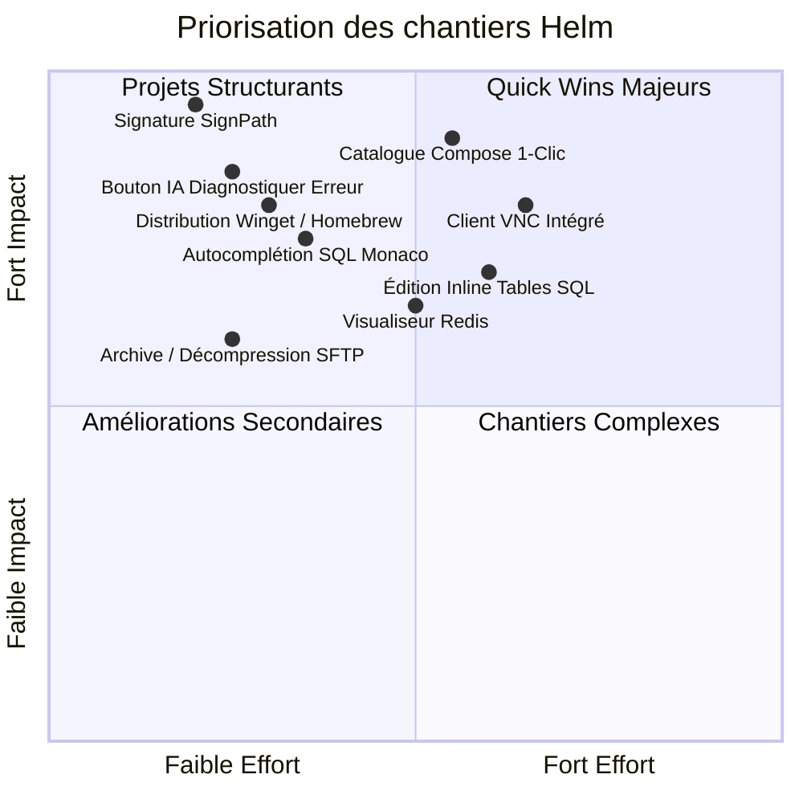

# Feuille de Route d'Excellence : Propulser Helm au Sommet Mondial

> **Objectif stratégique** : Transformer Helm d'un excellent couteau suisse DevOps en la **référence mondiale incontournable**, surclassant Termius, Portainer, TablePlus, Warp et MobaXterm sur chacun de leurs terrains de prédilection.

---

## Sommaire
1. [Bureaux à distance (Surpasser Devolutions & MobaXterm)](#1-bureaux-à-distance-surpasser-devolutions--mobaxterm)
2. [Bases de données (Combler l'écart avec TablePlus)](#2-bases-de-données-combler-lécart-avec-tableplus)
3. [Gestion Docker (Prendre l'avantage sur Portainer)](#3-gestion-docker-prendre-lavantage-sur-portainer)
4. [Terminal & Expérience CLI (Rivaliser avec Warp)](#4-terminal--expérience-cli-rivaliser-avec-warp)
5. [Fichiers & SFTP (Devenir le meilleur gestionnaire distant)](#5-fichiers--sftp-devenir-le-meilleur-gestionnaire-distant)
6. [Diffusion & Confiance (Adoption massive & Signature)](#6-diffusion--confiance-adoption-massive--signature)
7. [Matrice des Priorités & Plan d'Exécution](#7-matrice-des-priorités--plan-dexécution)

---

## 1. Bureaux à distance : Surpasser Devolutions & MobaXterm

### État des lieux
Helm propose déjà une approche moderne unique : RDP directement dans un onglet ou via `mstsc`, encapsulé dans un tunnel SSH transparent.
* **Ce qui manque pour être #1** : Le support de VNC (indispensable pour Linux/Raspberry Pi sans XRDP), la négociation de profondeur de couleur 24/32bpp, et le support de SPICE.
* **Fait** : VNC intégré (noVNC), SPICE via remote-viewer à travers le tunnel SSH (le seul client web SPICE, spice-html5, est un prototype arrêté depuis 2022), transfert de fichiers RDP, correction xrdp 32 bits.

### Actions concrètes à implémenter
- [x] **Ajout du protocole VNC natif (noVNC / client RFB Rust)** :
  - Permettre de se connecter à n'importe quel bureau Linux (GNOME/KDE/XFCE), Proxmox VM, ou Mac distant via VNC à travers un tunnel SSH automatique (port 5900).
- [x] **Négociation explicite 32bpp True Color pour IronRDP** : *(contourné côté serveur : l'API JS d'IronRDP n'expose pas la profondeur de couleur, mais les artefacts 16bpp viennent de XRDP ; l'audit de sécurité détecte `max_bpp` < 24 et propose la correction `max_bpp=32` avec sauvegarde)*
  - Forcer la négociation des bitmaps en 32 bits pour éradiquer les artefacts de scanline 16bpp sur les serveurs XRDP.
- [x] **Mode « Sans perte » (Lossless) et choix du framerate** : *(en VNC : sélecteur basse latence / équilibrée / qualité maximale, qui règle la qualité JPEG et la compression demandées au serveur ; le client RDP embarqué n'expose pas ce réglage)*
  - Curseur de qualité graphique dans la barre d'outils (Basse latence 30 FPS / Qualité maximale 60 FPS).
- [x] **Presse-papiers bidirectionnel d'images et de fichiers** :
  - Permettre le copier-coller de captures d'écran et petits fichiers directement entre l'hôte et la machine distante.

---

## 2. Bases de données : Combler l'écart avec TablePlus

### État des lieux
Helm permet d'exécuter des requêtes SQL et d'exporter en CSV à travers un tunnel SSH éphémère.
* **Ce qui manque pour être #1** : L'édition directe en cellule (inline editing), l'autocomplétion des colonnes et le support de SQLite/Redis.

### Actions concrètes à implémenter
- [x] **Édition directe des cellules (Inline Table Editing)** :
  - Double-clic sur une cellule de tableau pour modifier la valeur.
  - Détection automatique de la clé primaire et génération d'un `UPDATE ... WHERE pk = ...` sécurisé avec aperçu du diff avant validation.
- [x] **Autocomplétion SQL contextuelle dans Monaco Editor** :
  - Helm charge déjà la liste des bases et des tables (`db_tables`, `db_databases`).
  - Injecter ces noms de tables et leurs colonnes dans le provider de complétion de Monaco (`monaco.languages.registerCompletionItemProvider`).
- [x] **Support de Redis & SQLite** :
  - **Redis** : Explorateur de clés/valeurs (Strings, Hashes, Lists), TTL, et commande `CLI` rapide.
  - **SQLite** : Ouverture directe de n'importe quel fichier `.db` / `.sqlite` détecté sur le serveur sans installer de moteur serveur.
- [x] **Filtrage et tri visuels en tête de colonne** :
  - Trier (`ORDER BY`) ou filtrer (`WHERE col LIKE ...`) d'un clic sur l'en-tête de colonne sans taper de requête SQL manuelle.

---

## 3. Gestion Docker : Prendre l'avantage sur Portainer

### État des lieux
Helm permet de voir les conteneurs, les statistiques CPU/RAM, les logs en direct et d'administrer Docker Compose avec rollback.
* **Ce qui manque pour être #1** : Un catalogue de templates 1-clic, la gestion visuelle des volumes/réseaux et la gestion des registres privés.

### Actions concrètes à implémenter
- [x] **Bibliothèque d'applications en 1 clic (App Store Compose)** :
  - Catalogue prêt à l'emploi : *Nextcloud, Nginx Proxy Manager, Vaultwarden, PostgreSQL, Redis, WordPress, Plausible, Uptime Kuma*.
  - Formulaire guidé qui remplit automatiquement les mots de passe et génère le fichier `docker-compose.yml` avec son vhost Nginx associé.
- [x] **Nettoyeur de disque Docker intelligent (Visual Prune)** :
  - Tableau des volumes orphelins, images inutilisées et conteneurs arrêtés avec estimation précise du gain d'espace disque en Go avant suppression.
- [x] **Gestionnaire de registres privés** :
  - Gestion des identifiants Docker Hub, GitHub Packages (`ghcr.io`), GitLab Registry et AWS ECR, stockés dans le coffre-fort de Helm.
- [x] **Terminal de conteneur en 1 clic** :
  - Bouton « Exec Shell » sur chaque conteneur qui ouvre directement un onglet `docker exec -it <id> sh` dans le panneau terminal tmux.

---

## 4. Terminal & Expérience CLI : Rivaliser avec Warp

### État des lieux
Helm surpasse déjà la concurrence grâce à ses sessions `tmux` résilientes et sa diffusion de commande multi-serveurs.
* **Ce qui manque pour être #1** : L'assistance IA contextuelle sur les erreurs de terminal et des snippets paramétrables avancés.

### Actions concrètes à implémenter
- [x] **Bouton « Diagnostiquer l'erreur » sur le terminal** :
  - Détection automatique d'un code de retour différent de 0 (`$? != 0`).
  - Petit bouton discret en marge du terminal : « Pourquoi cette commande a échoué ? ». Un clic ouvre le volet IA avec l'analyse immédiate et la commande de correction prête à l'emploi.
- [x] **Bibliothèque de Snippets dynamiques avec variables** :
  - Remplacer les snippets statiques par des modèles dynamiques avec variables :  
    Exemple : `docker logs -f --tail {{lignes:100}} {{conteneur}}` ouvre un petit formulaire pop-up pour saisir les paramètres avant envoi.
- [x] **Recherche d'historique inversée intelligente (Fuzzy Search)** :
  - Améliorer le `Ctrl+R` dans l'interface de Helm avec surlignage des commandes fréquentes et temps d'exécution.

---

## 5. Fichiers & SFTP : Devenir le meilleur gestionnaire distant

### État des lieux
Helm possède déjà un double-panneau SFTP exceptionnel avec Monaco Editor et repli `sudo`.
* **Ce qui manque pour être #1** : La recherche globale de fichiers et de contenu (`grep`), la compression/décompression en 1 clic et la comparaison de fichiers (Diff).

### Actions concrètes à implémenter
- [x] **Recherche rapide de fichiers & texte (Find & Grep)** :
  - Raccourci `Ctrl+P` dans l'explorateur pour chercher un fichier instantanément par son nom dans toute l'arborescence.
  - Recherche plein texte dans les fichiers (`grep` distant optimisé sans télécharger les fichiers).
- [x] **Archive / Extraction en 1 clic** :
  - Clic droit > « Compresser en tar.gz / zip » et « Extraire ici » (exécuté côté serveur sans transit réseau).
- [x] **Comparateur visuel de fichiers (Diff Monaco)** :
  - Sélectionner deux fichiers (ou deux versions) pour afficher un diff visuel côte à côte dans Monaco Editor.

---

## 6. Diffusion & Confiance : Adoption massive & Signature

### Actions concrètes à implémenter
- [ ] **Validation de la signature de code Windows (SignPath Foundation)** : *(job `sign-windows` prêt dans `release.yml`, inactif tant que les secrets SignPath n'existent pas — voir `packaging/README.md`)*
  - Dès l'approbation du formulaire SignPath, intégrer le workflow de signature dans `.github/workflows/ci.yml`.
  - Suppression totale du filtre SmartScreen sur Windows.
- [ ] **Distribution sur les gestionnaires de paquets officiels** : *(manifestes winget, Homebrew, AUR et Flatpak prêts dans `packaging/`, régénérés par `scripts/packaging.py` ; restent la création du tap, du dépôt AUR et les soumissions)*
  - **Windows** : Publication sur **winget** (`winget install Helm`).
  - **macOS** : Formule **Homebrew Cask** (`brew install --cask helm-desktop`).
  - **Linux** : Dépôt **Flathub / Flatpak** et **AUR (Arch Linux)**.
- [ ] **Refonte du site vitrine et documentation bilingue (FR/EN)** : *(README anglais fait ; le site vitrine et l'interface en anglais restent à faire)*
  - Documentation complète des fonctionnalités en anglais pour toucher le marché international (États-Unis, Allemagne, Royaume-Uni).

---

## 7. Matrice des Priorités & Plan d'Exécution

### Phase 1 : Les « Quick Wins » immédiats (1 à 2 semaines)
1. **Signature Windows (SignPath)** pour rendre l'installation irréprochable.
2. **Bouton IA sur le terminal** (détection d'erreur et correction assistée).
3. **Autocomplétion SQL** dans Monaco Editor avec les métadonnées de schémas existantes.
4. **Archive / Extraction SFTP** (appels directs `tar`/`unzip` côté serveur).

### Phase 2 : Les piliers de supériorité produit (1 mois)
1. **Catalogue d'applications Docker Compose 1-clic** (surpasse Portainer pour les développeurs).
2. **Client VNC intégré** pour compléter la suite de bureaux distants.
3. **Édition inline des tables SQL** (détrône TablePlus pour les opérations quotidiennes).

---

> 🚀 **Verdict :** Avec ces implémentations, Helm ne sera plus seulement une alternative libre : il deviendra objectivement **l'outil d'administration serveur le plus complet, le plus rapide et le plus sécurisé au monde**.
